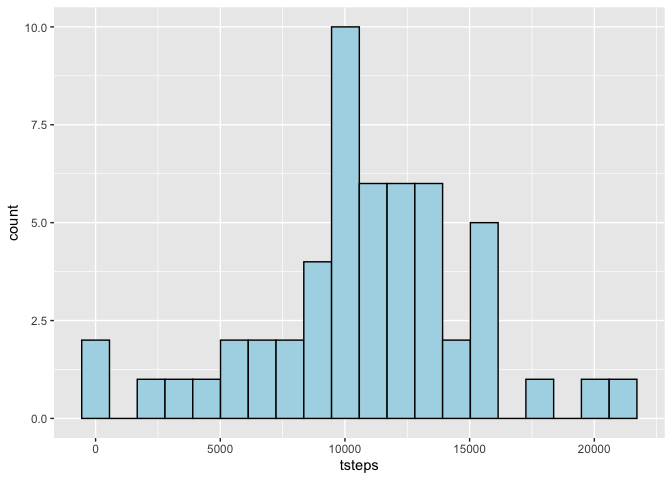
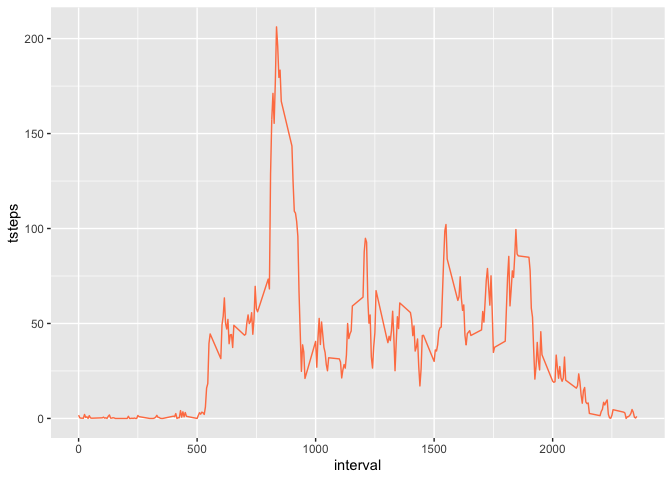
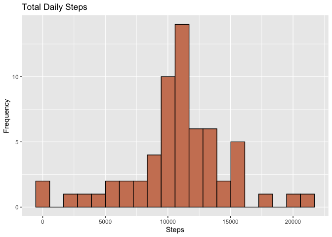
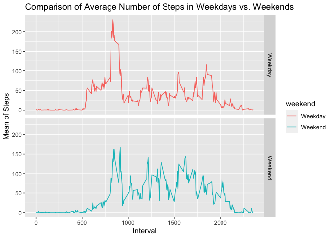

## Loading and preprocessing the data


```r
# unzip and read data
if(!file.exists('activity.csv')){
    unzip('activity.zip')
}

stepdata <- read.csv("activity.csv", header = TRUE)
head(stepdata)
```

```
##   steps       date interval
## 1    NA 2012-10-01        0
## 2    NA 2012-10-01        5
## 3    NA 2012-10-01       10
## 4    NA 2012-10-01       15
## 5    NA 2012-10-01       20
## 6    NA 2012-10-01       25
```


## What is mean total number of steps taken per day?

#### 1. Calculate the total number of steps taken per day


```r
# transform the data
stepsbyday <- stepdata %>% 
  select(date, steps) %>% 
  group_by(date) %>% 
  summarize(tsteps= sum(steps)) %>%
  na.omit()
```

#### 2. Histogram Total number of steps taken each day


```r
hist<-ggplot(stepsbyday, aes(x=tsteps)) + geom_histogram(bins=20, color="black",fill="lightblue")
hist
```

<!-- -->

#### 3. Mean and median number of steps taken each day  

```r
with(stepsbyday, mean(tsteps))
```

```
## [1] 10766.19
```

```r
with(stepsbyday, median(tsteps))
```

```
## [1] 10765
```

## What is the average daily activity pattern?

#### 1. Time series plot of the average number of steps taken

```r
databyinterval <- stepdata%>% 
  select(interval, steps) %>% 
  na.omit() %>% 
  group_by(interval) %>% 
  summarize(tsteps= mean(steps)) 
```


```r
ggplot(databyinterval, aes(x=interval, y=tsteps))+ geom_line(color="coral")
```

<!-- -->

#### 2. The 5-minute interval that, on average, contains the maximum number of steps


```r
databyinterval[which(databyinterval$tsteps== max(databyinterval$tsteps)),]
```

```
## # A tibble: 1 x 2
##   interval tsteps
##      <int>  <dbl>
## 1      835   206.
```

## Imputing missing values

#### 1. Calculate and report the total number of missing values in the dataset (i.e. the total number of rows with NAs)


```r
missingvalues<-sum(is.na(stepdata))
missingvalues
```

```
## [1] 2304
```

#### 2. Devise a strategy for filling in all of the missing values in the dataset. The strategy does not need to be sophisticated. For example, you could use the mean/median for that day, or the mean for that 5-minute interval, etc.

#### 3. Create a new dataset that is equal to the original dataset but with the missing data filled in.

I'll create a new dataset that is equal to the original dataset but with the missing data filled in using the mean for the 5 minute interval.And I'll check again for the number of missing values in the new dataset for verification.


```r
replacewithmean <- function(x) replace(x, is.na(x), mean(x, na.rm = TRUE))
meandata <- stepdata%>% 
  group_by(interval) %>% 
  mutate(steps= replacewithmean(steps))
head(meandata)
```

```
## # A tibble: 6 x 3
## # Groups:   interval [6]
##    steps date       interval
##    <dbl> <chr>         <int>
## 1 1.72   2012-10-01        0
## 2 0.340  2012-10-01        5
## 3 0.132  2012-10-01       10
## 4 0.151  2012-10-01       15
## 5 0.0755 2012-10-01       20
## 6 2.09   2012-10-01       25
```

```r
missingvalues<-sum(is.na(meandata))
missingvalues
```

```
## [1] 0
```

#### 4. Histogram Total number of steps taken each day using the new dataset


```r
newdatabyday <- aggregate(meandata$steps, by=list(meandata$date), sum)

names(newdatabyday)[1] ="date"
names(newdatabyday)[2] ="totalsteps"
head(newdatabyday,15)
```

```
##          date totalsteps
## 1  2012-10-01   10766.19
## 2  2012-10-02     126.00
## 3  2012-10-03   11352.00
## 4  2012-10-04   12116.00
## 5  2012-10-05   13294.00
## 6  2012-10-06   15420.00
## 7  2012-10-07   11015.00
## 8  2012-10-08   10766.19
## 9  2012-10-09   12811.00
## 10 2012-10-10    9900.00
## 11 2012-10-11   10304.00
## 12 2012-10-12   17382.00
## 13 2012-10-13   12426.00
## 14 2012-10-14   15098.00
## 15 2012-10-15   10139.00
```

```r
summary(newdatabyday)
```

```
##      date             totalsteps   
##  Length:61          Min.   :   41  
##  Class :character   1st Qu.: 9819  
##  Mode  :character   Median :10766  
##                     Mean   :10766  
##                     3rd Qu.:12811  
##                     Max.   :21194
```

```r
histnew<-ggplot(newdatabyday, aes(x=totalsteps)) + geom_histogram(bins=20, color="black",fill="lightsalmon3")+xlab("Steps")+ylab("Frequency")+ggtitle("Total Daily Steps")
histnew
```

<!-- -->

#### 5. Mean and median number of steps taken each day with old and new data 

```r
#Old data
with(stepsbyday, mean(tsteps))
```

```
## [1] 10766.19
```

```r
with(stepsbyday, median(tsteps))
```

```
## [1] 10765
```

```r
#New data
with(newdatabyday, mean(totalsteps))
```

```
## [1] 10766.19
```

```r
with(newdatabyday, median(totalsteps))
```

```
## [1] 10766.19
```

Do these values differ from the estimates from the first part of the assignment? What is the impact of imputing missing data on the estimates of the total daily number of steps?

Mean values do not change, which is consistent with tha fact that we used the mean method to inpute missig values. However, median values slightly differ. 


## Are there differences in activity patterns between weekdays and weekends?

#### 1. Create a new factor variable in the dataset with two levels – “weekday” and “weekend” indicating whether a given date is a weekday or weekend day.


```r
meandata$date <- as.Date(meandata$date)
meandata$weekday <- weekdays(meandata$date)
meandata$weekend <- ifelse(meandata$weekday=="Saturday" | meandata$weekday=="Sunday", "Weekend", "Weekday" )

mdataweekendweekday <- aggregate(meandata$steps , by= list(meandata$weekend, meandata$interval), na.omit(mean))
names(mdataweekendweekday) <- c("weekend", "interval", "steps")
```

#### 2. Panel plot comparing the average number of steps taken per 5-minute interval across weekdays and weekends

```r
ggplot(mdataweekendweekday, aes(x=interval, y=steps, color=weekend)) + geom_line()+
  facet_grid(weekend ~.) + xlab("Interval") + ylab("Mean of Steps") +
  ggtitle("Comparison of Average Number of Steps in Weekdays vs. Weekends")
```

<!-- -->


